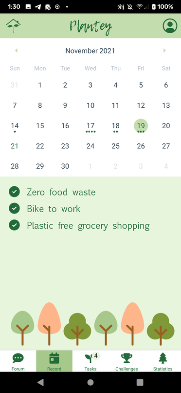

# Plantey

For our project at Hackatum 2021, we developed a small mobile app meant to encourage people to live a more eco-friendly lifestyle. We

Plantey is meant to gameify doing eco-friendly acts, by giving the user points everytime they complete an action, and later converting these points into plated trees with the help of the app partners. As an example we thought partners such as Microsoft, Interhyp or the municipality of Munich might sponsor such an app. (They are also Hackatum partners).

